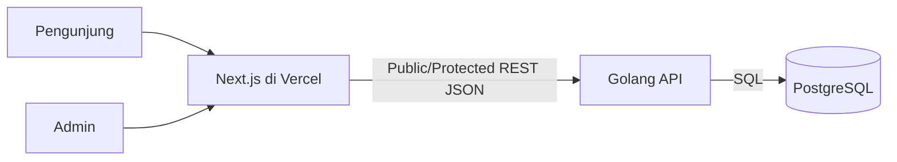

# Panduan Arsitektur untuk AI Agent

Dokumen ini menentukan batas sistem. Jangan membuat komponen infrastruktur baru sebelum komponen tersebut benar-benar ada dalam scope task.

## Target Arsitektur



| Lapisan | Tanggung jawab | Bukan tanggung jawab |
| --- | --- | --- |
| Next.js | UI publik/admin, rendering, form state, cookie session, mapping API | Business rule final, akses database langsung |
| Golang API | Auth, authorization, validasi, business rule, transaksi | Rendering UI |
| PostgreSQL | Persistence, constraint, relasi, index | Format respons HTTP |

Repository memakai monorepo sederhana tanpa Turborepo/Nx:

```text
src/                 frontend Next.js
backend/             Golang API, migration, CLI admin, dan Dockerfile
docs/                kontrak lintas frontend/backend
```

Frontend tetap di root agar deployment Vercel saat ini tidak perlu dipindah. Jangan menaruh `DATABASE_URL` atau query SQL runtime di frontend.

Status implementasi backend saat ini:

- tersedia: health, auth, public content, seluruh CRUD admin, PostgreSQL store, migration schema/seed, dan CLI create-admin;
- belum tersedia: upload file/media dan audit log mutation.

## Alur Publik

1. Next.js mengambil public endpoint.
2. API hanya mengembalikan record `is_active = true` sesuai `order_index`.
3. Frontend memetakan JSON `snake_case` menjadi type UI.
4. Jika API gagal dijangkau, data lokal boleh menjadi fallback. Array kosong yang valid dari API tidak boleh diganti fallback.

Pilih Server Component untuk data yang tidak membutuhkan browser state. Gunakan Client Component hanya untuk interaksi, timer, atau browser API.

## Alur Admin

1. Form login mengirim credential ke server-side endpoint Next.js.
2. Next.js meneruskan credential ke `POST /auth/login`.
3. Token disimpan di cookie `httpOnly`; jangan kirim ke JavaScript browser.
4. Request admin server-side membaca cookie dan menambahkan Bearer token ke API.
5. API memverifikasi JWT sebelum handler admin dijalankan.
6. UI hanya menampilkan sukses setelah API mengonfirmasi mutation.

Dashboard dipublikasikan melalui `admin.unaproject.my.id`, sedangkan website publik berada di `unaproject.my.id`. Keduanya memakai deployment Next.js yang sama dan cookie admin tetap host-only.

## Aturan Keamanan

- Password di-hash dengan Argon2id atau bcrypt; tidak pernah disimpan/log sebagai plaintext.
- JWT secret hanya berada di secret manager/environment backend.
- Cookie production: `HttpOnly`, `Secure`, dan `SameSite=Lax` atau lebih ketat.
- Validasi authorization di API, bukan hanya menyembunyikan tombol.
- Browser memakai BFF Next.js dan tidak memanggil API admin secara langsung, sehingga CORS tidak perlu diaktifkan saat ini.
- Gunakan generic error untuk login agar tidak membocorkan email terdaftar.
- Jangan memasukkan token, password, database URL, atau PII ke log.

## Struktur Backend

Struktur aktif memisahkan HTTP, auth, konfigurasi, dan persistence tanpa framework tambahan:

```txt
cmd/api/
cmd/create-admin/
internal/api/
internal/auth/
internal/config/
internal/store/
migrations/
```

Jangan menambah message queue, event bus, cache, microservice, atau framework kompleks tanpa kebutuhan terukur. Go `net/http` cukup sebagai default; gunakan framework hanya jika repository backend sudah menetapkannya.

## Error dan Transaksi

- Handler memvalidasi JSON dan menerjemahkan error domain ke status HTTP.
- Service menangani rule lintas entity.
- Repository menjalankan SQL dan tidak membentuk respons HTTP.
- Mutation parent beserta children, seperti produk dan varian, harus berada dalam satu transaksi.
- Timeout/cancellation dari request harus diteruskan ke query database.

## Observability Minimum

Log terstruktur cukup memuat request ID, method, path, status, duration, dan error code aman. Tambahkan tracing atau metrics lanjutan hanya ketika deployment membutuhkannya.

## Checklist Agent

- Kontrak endpoint sesuai `API_SPECIFICATION.md`.
- Field dan constraint sesuai `DATABASE_SCHEMA.md`.
- Tidak ada secret di frontend atau git.
- Auth diuji untuk success, invalid credential, expired token, dan protected route.
- Mutation kritis memakai transaksi dan mengembalikan error yang konsisten.
