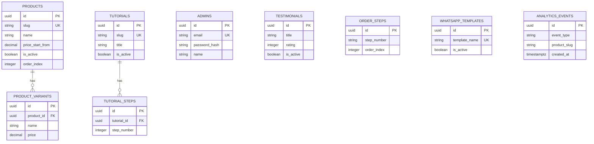

# Kontrak Database untuk AI Agent

Dokumen ini menjelaskan baseline PostgreSQL untuk backend UNA Project. Schema executable berada di `backend/migrations/001_init.sql` dan konten awal berada di `002_seed_frontend_content.sql`. Jangan mengedit database production secara manual atau destruktif tanpa izin user dan backup.

## Relasi



## Baseline SQL

Gunakan ini sebagai migration awal pada database baru.

```sql
CREATE EXTENSION IF NOT EXISTS "uuid-ossp";

CREATE TABLE admins (
    id UUID PRIMARY KEY DEFAULT uuid_generate_v4(),
    email VARCHAR(255) UNIQUE NOT NULL,
    password_hash VARCHAR(255) NOT NULL,
    name VARCHAR(100) NOT NULL,
    created_at TIMESTAMPTZ NOT NULL DEFAULT CURRENT_TIMESTAMP,
    updated_at TIMESTAMPTZ NOT NULL DEFAULT CURRENT_TIMESTAMP
);

CREATE TABLE products (
    id UUID PRIMARY KEY DEFAULT uuid_generate_v4(),
    slug VARCHAR(150) UNIQUE NOT NULL,
    name VARCHAR(150) NOT NULL,
    category VARCHAR(50) NOT NULL,
    short_description VARCHAR(255) NOT NULL,
    description TEXT NOT NULL,
    dimensions VARCHAR(100),
    features TEXT[] NOT NULL DEFAULT '{}',
    price_start_from NUMERIC(12, 2) NOT NULL DEFAULT 0 CHECK (price_start_from >= 0),
    image_url VARCHAR(500),
    video_url VARCHAR(500),
    is_featured BOOLEAN NOT NULL DEFAULT FALSE,
    is_active BOOLEAN NOT NULL DEFAULT TRUE,
    order_index INTEGER NOT NULL DEFAULT 0,
    created_at TIMESTAMPTZ NOT NULL DEFAULT CURRENT_TIMESTAMP,
    updated_at TIMESTAMPTZ NOT NULL DEFAULT CURRENT_TIMESTAMP
);

CREATE TABLE product_variants (
    id UUID PRIMARY KEY DEFAULT uuid_generate_v4(),
    product_id UUID NOT NULL REFERENCES products(id) ON DELETE CASCADE,
    name VARCHAR(100) NOT NULL,
    price NUMERIC(12, 2) NOT NULL DEFAULT 0 CHECK (price >= 0),
    description VARCHAR(255),
    order_index INTEGER NOT NULL DEFAULT 0
);

CREATE TABLE testimonials (
    id UUID PRIMARY KEY DEFAULT uuid_generate_v4(),
    title VARCHAR(150) NOT NULL,
    description TEXT NOT NULL,
    image_url VARCHAR(500),
    image_alt VARCHAR(255) NOT NULL,
    role_location VARCHAR(150),
    rating INTEGER NOT NULL DEFAULT 5 CHECK (rating BETWEEN 1 AND 5),
    is_active BOOLEAN NOT NULL DEFAULT TRUE,
    order_index INTEGER NOT NULL DEFAULT 0,
    created_at TIMESTAMPTZ NOT NULL DEFAULT CURRENT_TIMESTAMP
);

CREATE TABLE tutorials (
    id UUID PRIMARY KEY DEFAULT uuid_generate_v4(),
    slug VARCHAR(150) UNIQUE NOT NULL,
    title VARCHAR(200) NOT NULL,
    category VARCHAR(50) NOT NULL,
    short_description VARCHAR(255) NOT NULL,
    video_url VARCHAR(500),
    is_active BOOLEAN NOT NULL DEFAULT TRUE,
    order_index INTEGER NOT NULL DEFAULT 0,
    created_at TIMESTAMPTZ NOT NULL DEFAULT CURRENT_TIMESTAMP
);

CREATE TABLE tutorial_steps (
    id UUID PRIMARY KEY DEFAULT uuid_generate_v4(),
    tutorial_id UUID NOT NULL REFERENCES tutorials(id) ON DELETE CASCADE,
    step_number INTEGER NOT NULL,
    title VARCHAR(150) NOT NULL,
    description TEXT NOT NULL,
    highlight VARCHAR(255),
    UNIQUE (tutorial_id, step_number)
);

CREATE TABLE order_steps (
    id UUID PRIMARY KEY DEFAULT uuid_generate_v4(),
    step_number VARCHAR(10) NOT NULL,
    title VARCHAR(150) NOT NULL,
    description TEXT NOT NULL,
    icon_name VARCHAR(50) NOT NULL DEFAULT 'whatsapp',
    is_active BOOLEAN NOT NULL DEFAULT TRUE,
    order_index INTEGER NOT NULL DEFAULT 0
);

CREATE TABLE whatsapp_templates (
    id UUID PRIMARY KEY DEFAULT uuid_generate_v4(),
    template_name VARCHAR(100) UNIQUE NOT NULL,
    category VARCHAR(50) NOT NULL DEFAULT 'umum',
    message_pattern TEXT NOT NULL,
    is_default BOOLEAN NOT NULL DEFAULT FALSE,
    is_active BOOLEAN NOT NULL DEFAULT TRUE,
    created_at TIMESTAMPTZ NOT NULL DEFAULT CURRENT_TIMESTAMP
);

CREATE INDEX idx_products_active_order ON products(is_active, order_index);
CREATE INDEX idx_products_category ON products(category);
CREATE INDEX idx_product_variants_product ON product_variants(product_id, order_index);
CREATE INDEX idx_testimonials_active_order ON testimonials(is_active, order_index);
CREATE INDEX idx_tutorials_active_order ON tutorials(is_active, order_index);
CREATE INDEX idx_tutorial_steps_tutorial ON tutorial_steps(tutorial_id, step_number);
CREATE INDEX idx_order_steps_active_order ON order_steps(is_active, order_index);
```

## Aturan Migration

- Satu perubahan schema per migration dengan `up` dan rollback yang aman bila tooling mendukungnya.
- Jangan mengubah migration yang sudah diterapkan; buat migration baru.
- Penambahan kolom wajib menentukan strategi default/backfill sebelum `NOT NULL`.
- Penghapusan kolom/tabel memerlukan konfirmasi user dan rencana backup.
- Seed admin tidak boleh menyimpan password plaintext; hasil hash saja.
- Backend harus mengatur `updated_at` saat update hingga trigger khusus memang diperlukan.
- `order_steps` hanya mengatur tujuh langkah pada halaman `/order`; tiga langkah homepage tetap berada di frontend.

## Aturan Data

- Public query selalu filter `is_active = true` dan urutkan `order_index`.
- Harga disimpan sebagai numeric IDR, bukan string berformat.
- Placeholder WhatsApp yang diizinkan harus divalidasi aplikasi; jangan mengeksekusi template sebagai kode.
- Penghapusan produk/tutorial menghapus child melalui cascade. UI harus meminta konfirmasi.
- Mutation parent dan seluruh child dilakukan dalam satu transaksi.

## Validasi Agent

Sebelum menyatakan perubahan schema selesai:

1. Jalankan migration pada database disposable/local.
2. Uji insert valid dan constraint utama.
3. Uji rollback bila tersedia.
4. Perbarui type/query backend dan `API_SPECIFICATION.md` dalam perubahan yang sama.
