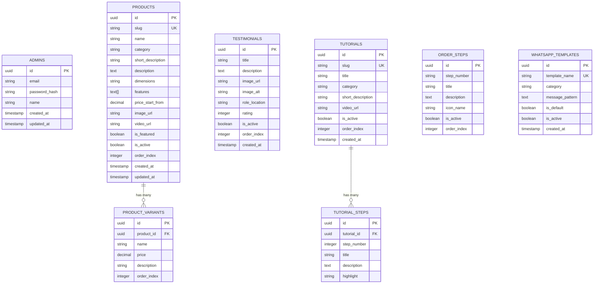

# Skema Database & ERD UNA Project

Dokumen ini memuat rancangan skema database relasional (PostgreSQL) untuk mendukung 5 fitur utama pada Admin Dashboard UNA Project:
1. **Manajemen Produk** (Katalog, Harga, Varian, Gambar, Deskripsi)
2. **Manajemen Testimoni** (CRUD dokumentasi pemasangan)
3. **Manajemen Tutorial** (Panduan dan langkah pengoperasian)
4. **Manajemen Alur Transaksi** (Langkah pemesanan kustom)
5. **Manajemen Template Chat WhatsApp** (Custom CTA message template)

---

## 1. Entity Relationship Diagram (ERD)



---

## 2. SQL DDL (Data Definition Language)

Gunakan perintah SQL berikut untuk membuat tabel di dalam database PostgreSQL (misal: melalui SQL Editor di Supabase):

```sql
-- Enable UUID extension
CREATE EXTENSION IF NOT EXISTS "uuid-ossp";

-- 1. TABEL ADMINS
CREATE TABLE admins (
    id UUID PRIMARY KEY DEFAULT uuid_generate_v4(),
    email VARCHAR(255) UNIQUE NOT NULL,
    password_hash VARCHAR(255) NOT NULL,
    name VARCHAR(100) NOT NULL,
    created_at TIMESTAMP WITH TIME ZONE DEFAULT CURRENT_TIMESTAMP,
    updated_at TIMESTAMP WITH TIME ZONE DEFAULT CURRENT_TIMESTAMP
);

-- 2. TABEL PRODUCTS
CREATE TABLE products (
    id UUID PRIMARY KEY DEFAULT uuid_generate_v4(),
    slug VARCHAR(150) UNIQUE NOT NULL,
    name VARCHAR(150) NOT NULL,
    category VARCHAR(50) NOT NULL,
    short_description VARCHAR(255) NOT NULL,
    description TEXT NOT NULL,
    dimensions VARCHAR(100),
    features TEXT[] DEFAULT '{}',
    price_start_from NUMERIC(12, 2) NOT NULL DEFAULT 0,
    image_url VARCHAR(500),
    video_url VARCHAR(500),
    is_featured BOOLEAN DEFAULT FALSE,
    is_active BOOLEAN DEFAULT TRUE,
    order_index INTEGER DEFAULT 0,
    created_at TIMESTAMP WITH TIME ZONE DEFAULT CURRENT_TIMESTAMP,
    updated_at TIMESTAMP WITH TIME ZONE DEFAULT CURRENT_TIMESTAMP
);

-- 3. TABEL PRODUCT_VARIANTS
CREATE TABLE product_variants (
    id UUID PRIMARY KEY DEFAULT uuid_generate_v4(),
    product_id UUID NOT NULL REFERENCES products(id) ON DELETE CASCADE,
    name VARCHAR(100) NOT NULL,
    price NUMERIC(12, 2) NOT NULL DEFAULT 0,
    description VARCHAR(255),
    order_index INTEGER DEFAULT 0
);

-- 4. TABEL TESTIMONIALS
CREATE TABLE testimonials (
    id UUID PRIMARY KEY DEFAULT uuid_generate_v4(),
    title VARCHAR(150) NOT NULL,
    description TEXT NOT NULL,
    image_url VARCHAR(500),
    image_alt VARCHAR(255) NOT NULL,
    role_location VARCHAR(150),
    rating INTEGER DEFAULT 5 CHECK (rating >= 1 AND rating <= 5),
    is_active BOOLEAN DEFAULT TRUE,
    order_index INTEGER DEFAULT 0,
    created_at TIMESTAMP WITH TIME ZONE DEFAULT CURRENT_TIMESTAMP
);

-- 5. TABEL TUTORIALS
CREATE TABLE tutorials (
    id UUID PRIMARY KEY DEFAULT uuid_generate_v4(),
    slug VARCHAR(150) UNIQUE NOT NULL,
    title VARCHAR(200) NOT NULL,
    category VARCHAR(50) NOT NULL,
    short_description VARCHAR(255) NOT NULL,
    video_url VARCHAR(500),
    is_active BOOLEAN DEFAULT TRUE,
    order_index INTEGER DEFAULT 0,
    created_at TIMESTAMP WITH TIME ZONE DEFAULT CURRENT_TIMESTAMP
);

-- 6. TABEL TUTORIAL_STEPS
CREATE TABLE tutorial_steps (
    id UUID PRIMARY KEY DEFAULT uuid_generate_v4(),
    tutorial_id UUID NOT NULL REFERENCES tutorials(id) ON DELETE CASCADE,
    step_number INTEGER NOT NULL,
    title VARCHAR(150) NOT NULL,
    description TEXT NOT NULL,
    highlight VARCHAR(255)
);

-- 7. TABEL ORDER_STEPS
CREATE TABLE order_steps (
    id UUID PRIMARY KEY DEFAULT uuid_generate_v4(),
    step_number VARCHAR(10) NOT NULL, -- Contoh: '01', '02', '03'
    title VARCHAR(150) NOT NULL,
    description TEXT NOT NULL,
    icon_name VARCHAR(50) DEFAULT 'whatsapp',
    is_active BOOLEAN DEFAULT TRUE,
    order_index INTEGER DEFAULT 0
);

-- 8. TABEL WHATSAPP_TEMPLATES
CREATE TABLE whatsapp_templates (
    id UUID PRIMARY KEY DEFAULT uuid_generate_v4(),
    template_name VARCHAR(100) UNIQUE NOT NULL, -- Contoh: 'konsultasi_jws', 'order_rgb', 'minta_katalog'
    category VARCHAR(50) DEFAULT 'umum',
    message_pattern TEXT NOT NULL, -- Contoh: 'Assalamualaikum, saya tertarik dengan {product_name}. Mohon info harga dan pemasangan.'
    is_default BOOLEAN DEFAULT FALSE,
    is_active BOOLEAN DEFAULT TRUE,
    created_at TIMESTAMP WITH TIME ZONE DEFAULT CURRENT_TIMESTAMP
);

-- Create Indexes for Performance
CREATE INDEX idx_products_slug ON products(slug);
CREATE INDEX idx_products_category ON products(category);
CREATE INDEX idx_product_variants_product_id ON product_variants(product_id);
CREATE INDEX idx_tutorials_slug ON tutorials(slug);
CREATE INDEX idx_tutorial_steps_tutorial_id ON tutorial_steps(tutorial_id);
```

---

## 3. Catatan Desain Database

1. **Cascading Deletes (`ON DELETE CASCADE`)**: Pada tabel varian produk dan langkah tutorial, penghapusan data induk (Produk / Tutorial) akan otomatis menghapus seluruh data anak/varian terkait.
2. **Order Indexing (`order_index`)**: Memungkinkan admin untuk mengurutkan posisi tampil kartu produk, testimoni, atau langkah pemesanan secara custom tanpa bergantung pada abjad atau tanggal pembuatan.
3. **Template WhatsApp Dinamis (`message_pattern`)**: Menggunakan sintaks placeholder seperti `{product_name}`, `{variant_name}`, atau `{category}` yang nantinya akan direplace secara dinamis oleh helper di Frontend sebelum membuka link `wa.me`.
